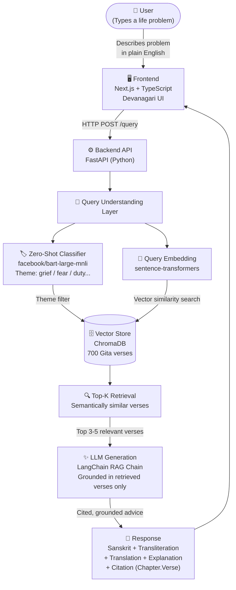
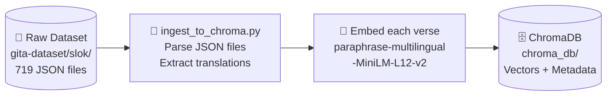
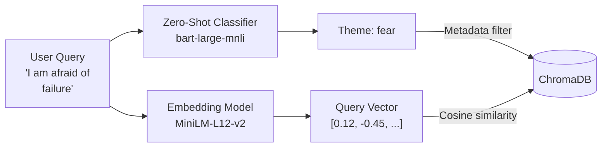
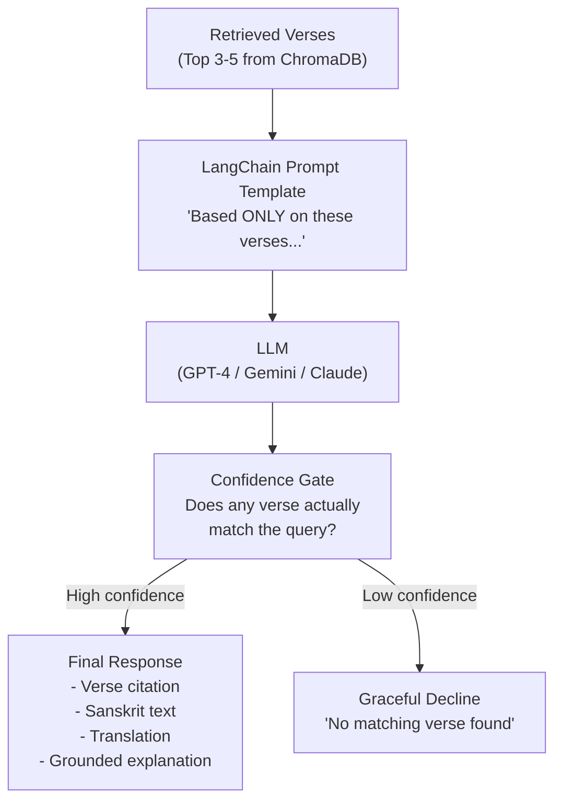
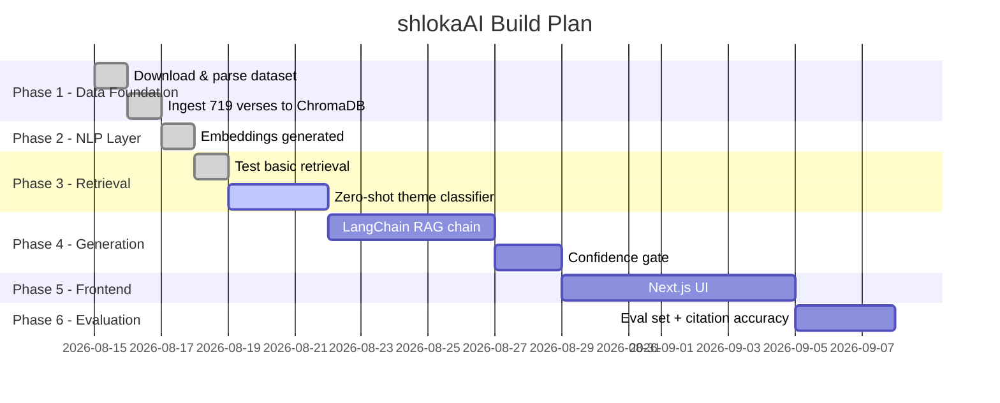

# shlokaAI (ShlokaAI) — System Architecture

A full-stack RAG (Retrieval-Augmented Generation) application that provides grounded life advice from the Bhagavad Gita.

---

## High-Level System Overview



---

## Data Pipeline (Offline / One-time Setup)



> ✅ **This step is COMPLETE.** 719 verses are embedded and stored.

---

## What Each Layer Does

### 1. 🖥️ Frontend (Not built yet — Phase 5)
| Property | Value |
|---|---|
| Framework | Next.js + TypeScript |
| Styling | Tailwind CSS |
| Fonts | Noto Sans Devanagari |
| Palette | Warm saffron / deep indigo |

---

### 2. ⚙️ Backend API (Not built yet — Phase 4-5)
| Property | Value |
|---|---|
| Framework | FastAPI |
| Language | Python |
| Endpoint | `POST /query` |
| Input | `{ "query": "I feel lost..." }` |
| Output | `{ verse, sanskrit, transliteration, explanation, citation }` |

---

### 3. 🧠 Query Understanding Layer (Phase 3 — In Progress)



The classifier and embedder work **in parallel**. The theme acts as a pre-filter to narrow the search space before the vector similarity runs.

---

### 4. 🗄️ ChromaDB Vector Store (✅ Complete)

Each document stored in ChromaDB has:

```
Document (searchable text):
  All English translations for a verse combined

Metadata (stored alongside):
  - chapter: 2
  - verse: 47
  - sanskrit: "कर्मण्येवाधिकारस्ते..."
  - transliteration: "karmaṇyevādhikāraste..."

ID:
  "BG2.47"
```

---

### 5. ✨ LLM Generation Layer (Phase 4 — Not built yet)



The **confidence gate** is critical — it prevents the LLM from fabricating Sanskrit or inventing verse citations.

---

## Current Progress



---

## File Structure (Current + Planned)

```
shlokaAI/
├── gita-dataset/          ✅ Raw data (cloned)
│   ├── slok/              ✅ 719 individual verse JSONs
│   └── chapter/           ✅ 18 chapter metadata JSONs
├── chroma_db/             ✅ ChromaDB local store
├── scripts/
│   ├── ingest_to_chroma.py   ✅ Data ingestion
│   └── test_retreival.py     ✅ Retrieval test
├── venv/                  ✅ Virtual environment
├── requirements.txt       ✅ Dependencies
│
│ -- NOT YET BUILT --
│
├── scripts/
│   └── classify_query.py  🔲 Zero-shot classifier (Phase 3)
├── api/
│   └── main.py            🔲 FastAPI backend (Phase 4-5)
├── frontend/              🔲 Next.js app (Phase 5)
└── eval/                  🔲 Evaluation scripts (Phase 6)
```
